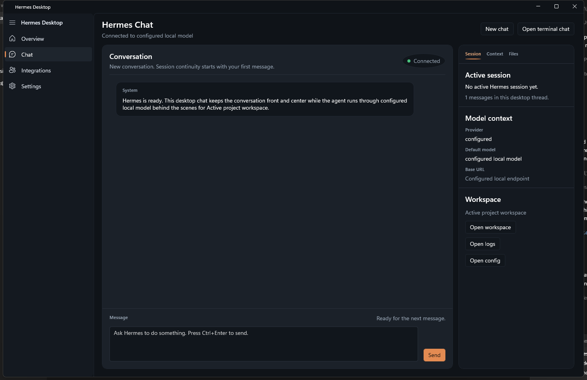

# A9N Desktop

Native Windows desktop shell for `upstream/a9n-agent`, built with `WinUI 3`.



## What It Is

A9N Desktop wraps an existing local A9N install in a Windows-native workspace with:

- a focused chat surface
- a native navigation shell
- quick access to logs, config, and workspace actions
- a lightweight local sidecar that bridges the WinUI app to A9N CLI

## Requirements

- Windows 10 or Windows 11
- .NET 10 SDK
- Visual Studio with WinUI / Windows App SDK tooling
- An existing `a9n-agent` installation

## Run The App

```powershell
powershell -ExecutionPolicy Bypass -File .\run-dev.ps1
```

A9N Desktop is privacy-safe by default. Local paths and endpoint details are hidden in the UI unless you explicitly opt in to showing them.

## Show Local Details

```powershell
powershell -ExecutionPolicy Bypass -File .\run-dev.ps1 -ShowLocalDetails
```

You can also enable detailed local display with an environment variable:

```powershell
$env:A9N_DESKTOP_SHOW_LOCAL_DETAILS = "1"
powershell -ExecutionPolicy Bypass -File .\run-dev.ps1
```

## Project Layout

- `Views/` WinUI pages
- `Services/` A9N environment, chat bridge, and sidecar launcher
- `sidecar/` local Python HTTP bridge to A9N CLI
- `Strings/en-us/Resources.resw` localized UI copy

## Status

The current build is focused on the chat-first desktop shell. The next layer is deeper session, context, and tool activity inside the native UI.
